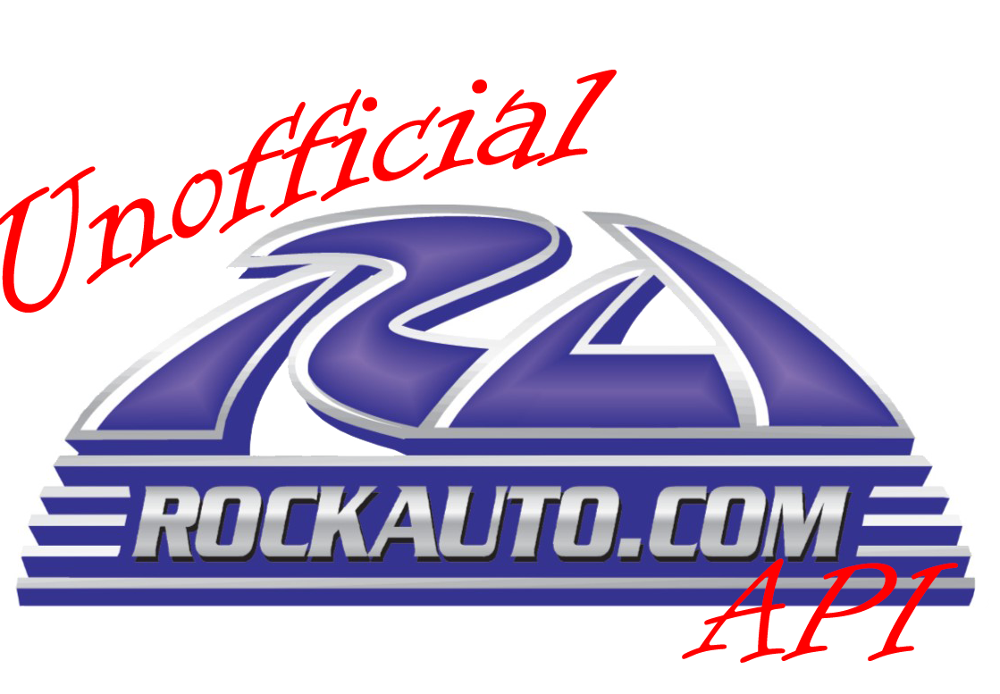

<!--
*** Thanks for checking out the Best-README-Template. If you have a suggestion
*** that would make this better, please fork the repo and create a pull request
*** or simply open an issue with the tag "enhancement".
*** Thanks again! Now go create something AMAZING! :D
***
***
***
*** To avoid retyping too much info. Do a search and replace for the following:
*** github_username, repo_name, twitter_handle, email, project_title, project_description
-->


<!-- PROJECT SHIELDS -->
<!--
*** I'm using markdown "reference style" links for readability.
*** Reference links are enclosed in brackets [ ] instead of parentheses ( ).
*** See the bottom of this document for the declaration of the reference variables
*** for contributors-url, forks-url, etc. This is an optional, concise syntax you may use.
*** https://www.markdownguide.org/basic-syntax/#reference-style-links
-->
[![Contributors][contributors-shield]][contributors-url]
[![Forks][forks-shield]][forks-url]
[![Stargazers][stars-shield]][stars-url]
[![Issues][issues-shield]][issues-url]
[![LinkedIn][linkedin-shield]][linkedin-url]


<!-- PROJECT LOGO -->
<br />
<p align="center">
  <a href="https://github.com/DanH-Walpole/rockauto-api-open">
    
  </a>

  <h3 align="center">Unofficial RockAuto API</h3>

  <p align="center">
    Unofficial RockAuto API for auto enthusiasts to easily access catalog data
    <br />
    <a href="https://github.com/DanH-Walpole/rockauto-api-open"><strong>Explore the docs »</strong></a>
    <br />
    <br />
    <a href="https://github.com/DanH-Walpole/rockauto-api-open/issues">Report Bug</a>
    ·
    <a href="https://github.com/DanH-Walpole/rockauto-api-open/issues">Request Feature</a>
  </p>
</p>


<!-- TABLE OF CONTENTS -->
<details open="open">
  <summary><h2 style="display: inline-block">Table of Contents</h2></summary>
  <ol>
    <li>
      <a href="#about-the-project">About The Project</a>
      <ul>
        <li><a href="#built-with">Built With</a></li>
      </ul>
    </li>
    <li>
      <a href="#getting-started">Getting Started</a>
      <ul>
        <li><a href="#prerequisites">Prerequisites</a></li>
        <li><a href="#installation">Installation</a></li>
      </ul>
    </li>
    <li><a href="#usage">Usage</a></li>
    <li><a href="#api-endpoints">API Endpoints</a></li>
    <li><a href="#roadmap">Roadmap</a></li>
    <li><a href="#contributing">Contributing</a></li>
    <li><a href="#license">License</a></li>
    <li><a href="#contact">Contact</a></li>
  </ol>
</details>


<!-- ABOUT THE PROJECT -->
## About The Project

The Unofficial RockAuto API is a dedicated tool for auto enthusiasts that allows programmatic access to RockAuto's catalog data. This API is not affiliated with or endorsed by RockAuto LLC.

### Key Features

* Browse vehicle makes, models, years, and engines
* Find specific parts with details including price and manufacturer information
* Access closeout deals for specific vehicles
* Get detailed vehicle information for enthusiasts

### Built With

* [FastAPI](https://fastapi.tiangolo.com/) - Modern web framework for building APIs
* [Beautiful Soup](https://www.crummy.com/software/BeautifulSoup/) - Web scraping library
* [Mechanize](https://mechanize.readthedocs.io/) - Library for automated web browsing


<!-- GETTING STARTED -->
## Getting Started

To get a local copy up and running, follow these steps:

### Prerequisites

* Python 3.7+
* pip

### Installation

1. Clone the repo
   ```sh
   git clone https://github.com/DanH-Walpole/rockauto-api-open.git
   ```
2. Install Python packages
   ```sh
   pip install -r requirements.txt
   ```
3. Install FastAPI and Uvicorn (if not already installed)
   ```sh
   pip install fastapi uvicorn
   ```
4. Run the API
   ```sh
   uvicorn rockauto:rockauto_api --reload
   ```


<!-- USAGE EXAMPLES -->
## Usage

The RockAuto API allows you to access vehicle and parts data programmatically. Here are some example use cases:

* Integration with car maintenance applications
* Building custom part catalogs for auto shops
* Creating vehicle information lookup tools
* Finding the best deals on parts through the closeouts endpoint


<!-- API ENDPOINTS -->
## API Endpoints

### Base URL
```
http://localhost:8000
```

### Available Endpoints

#### Get API Information
```
GET /
```
Returns an overview of available endpoints.

#### List Vehicle Makes
```
GET /makes
```
Returns a list of all vehicle makes available in the RockAuto catalog.

#### Get Years for a Make
```
GET /years/{search_vehicle}?search_make=Toyota&search_link={link}
```
Returns available years for the specified make.

#### Get Models for a Year
```
GET /models/{search_vehicle}?search_make=Toyota&search_year=2015&search_link={link}
```
Returns available models for the specified make and year.

#### Get Engines for a Model
```
GET /engines/{search_vehicle}?search_make=Toyota&search_year=2015&search_model=Camry&search_link={link}
```
Returns available engines for the specified model.

#### Get Part Categories
```
GET /categories/{search_vehicle}?search_make=Toyota&search_year=2015&search_model=Camry&search_engine=2.5L&search_link={link}
```
Returns part categories for the specified vehicle.

#### Get Sub-Categories
```
GET /sub_categories/{search_vehicle}?search_make=Toyota&search_year=2015&search_model=Camry&search_engine=2.5L&search_category=Brake&search_link={link}
```
Returns sub-categories within a part category.

#### Get Parts List
```
GET /parts/{search_vehicle}?search_make=Toyota&search_year=2015&search_model=Camry&search_engine=2.5L&search_category=Brake&search_subcategory=Pads&search_link={link}
```
Returns a list of parts with details including price, manufacturer, and notes.

#### Get Closeout Deals
```
GET /closeouts/{carcode}
```
Returns closeout deals for a specific vehicle using its carcode.

#### Search for Parts and Vehicles
```
GET /search?search_make=Toyota&search_year=2015&search_model=Camry&search_engine=2.5L&search_category=Brake&search_subcategory=Pads
```
A flexible search endpoint that allows incremental exploration of vehicles and parts. Parameters are optional and the response includes available options for missing parameters.

Examples:
- `/search` - Returns a list of all available makes
- `/search?search_make=Toyota` - Returns available years for Toyota vehicles
- `/search?search_make=Toyota&search_year=2015` - Returns available models for 2015 Toyota vehicles
- `/search?search_make=Toyota&search_year=2015&search_model=Camry` - Returns available engines for 2015 Toyota Camry

#### Get Vehicle Information
```
GET /vehicle_info/{search_vehicle}?search_make=Toyota&search_year=2015&search_model=Camry&search_engine=2.5L&search_link={link}
```
Returns detailed vehicle information including assembly details and specifications.


<!-- ROADMAP -->
## Roadmap

See the [open issues](https://github.com/DanH-Walpole/rockauto-api-open/issues) for a list of proposed features and known issues.


<!-- CONTRIBUTING -->
## Contributing

Contributions make the open source community an amazing place to learn, inspire, and create. Any contributions are **greatly appreciated**.

1. Fork the Project
2. Create your Feature Branch (`git checkout -b feature/AmazingFeature`)
3. Commit your Changes (`git commit -m 'Add some AmazingFeature'`)
4. Push to the Branch (`git push origin feature/AmazingFeature`)
5. Open a Pull Request


<!-- LICENSE -->
## License

This project is not currently licensed and is provided for educational purposes only. Use at your own risk.


<!-- CONTACT -->
## Contact

Project Link: [https://github.com/DanH-Walpole/rockauto-api-open](https://github.com/DanH-Walpole/rockauto-api-open)


<!-- MARKDOWN LINKS & IMAGES -->
<!-- https://www.markdownguide.org/basic-syntax/#reference-style-links -->
[contributors-shield]: https://img.shields.io/github/contributors/DanH-Walpole/rockauto-api-open.svg?style=for-the-badge
[contributors-url]: https://github.com/DanH-Walpole/rockauto-api-open/graphs/contributors
[forks-shield]: https://img.shields.io/github/forks/DanH-Walpole/rockauto-api-open.svg?style=for-the-badge
[forks-url]: https://github.com/DanH-Walpole/rockauto-api-open/network/members
[stars-shield]: https://img.shields.io/github/stars/DanH-Walpole/rockauto-api-open.svg?style=for-the-badge
[stars-url]: https://github.com/DanH-Walpole/rockauto-api-open/stargazers
[issues-shield]: https://img.shields.io/github/issues/DanH-Walpole/rockauto-api-open.svg?style=for-the-badge
[issues-url]: https://github.com/DanH-Walpole/rockauto-api-open/issues
[linkedin-shield]: https://img.shields.io/badge/-LinkedIn-black.svg?style=for-the-badge&logo=linkedin&colorB=555
[linkedin-url]: https://linkedin.com/in/danwalpole
