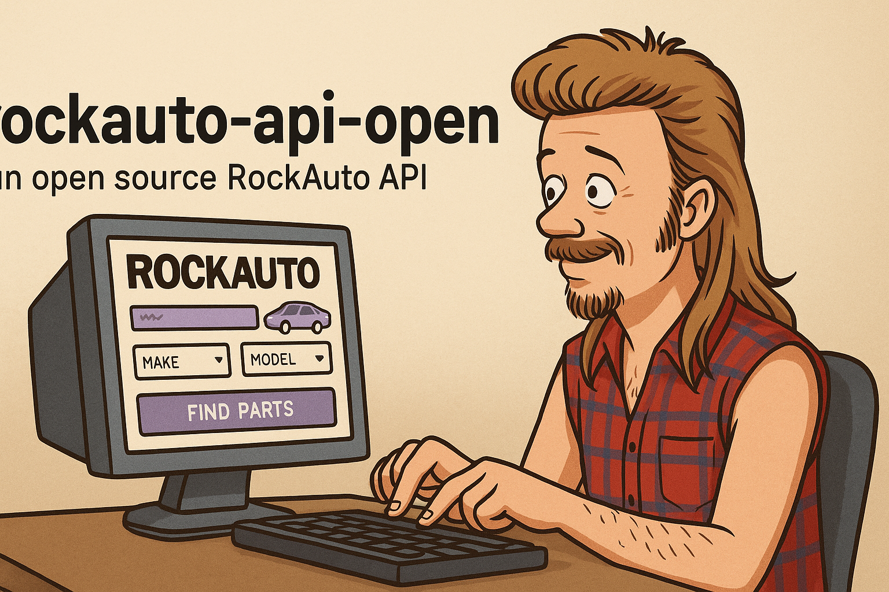

<!--
*** Thanks for checking out the Best-README-Template. If you have a suggestion
*** that would make this better, please fork the repo and create a pull request
*** or simply open an issue with the tag "enhancement".
*** Thanks again! Now go create something AMAZING! :D
***
***
***
*** To avoid retyping too much info. Do a search and replace for the following:
*** github_username, repo_name, twitter_handle, email, project_title, project_description
-->


<!-- PROJECT SHIELDS -->
<!--
*** I'm using markdown "reference style" links for readability.
*** Reference links are enclosed in brackets [ ] instead of parentheses ( ).
*** See the bottom of this document for the declaration of the reference variables
*** for contributors-url, forks-url, etc. This is an optional, concise syntax you may use.
*** https://www.markdownguide.org/basic-syntax/#reference-style-links
-->
[![Contributors][contributors-shield]][contributors-url]
[![Forks][forks-shield]][forks-url]
[![Stargazers][stars-shield]][stars-url]
[![Issues][issues-shield]][issues-url]
[![LinkedIn][linkedin-shield]][linkedin-url]


<!-- PROJECT LOGO -->
<br />
<p align="center">
  <a href="https://github.com/DanH-Walpole/rockauto-api-open">
    
  </a>

  <h3 align="center">Unofficial RockAuto API</h3>

  <p align="center">
    An unofficial RockAuto API that extends and carries on the work of the original creator
    <br />
    This project is not associated with RockAuto LLC
    <br />
    <a href="https://github.com/DanH-Walpole/rockauto-api-open"><strong>Explore the docs »</strong></a>
    <br />
    <br />
    <a href="https://github.com/DanH-Walpole/rockauto-api-open/issues">Report Bug</a>
    ·
    <a href="https://github.com/DanH-Walpole/rockauto-api-open/issues">Request Feature</a>
  </p>
</p>


<!-- TABLE OF CONTENTS -->
<details open="open">
  <summary><h2 style="display: inline-block">Table of Contents</h2></summary>
  <ol>
    <li>
      <a href="#about-the-project">About The Project</a>
      <ul>
        <li><a href="#built-with">Built With</a></li>
      </ul>
    </li>
    <li>
      <a href="#getting-started">Getting Started</a>
      <ul>
        <li><a href="#prerequisites">Prerequisites</a></li>
        <li><a href="#installation">Installation</a></li>
      </ul>
    </li>
    <li><a href="#usage">Usage</a></li>
    <li><a href="#roadmap">Roadmap</a></li>
    <!-- <li><a href="#contributing">Contributing</a></li> -->
    <!-- <li><a href="#license">License</a></li> -->
    <li><a href="#contact">Contact</a></li>
    <li><a href="#acknowledgements">Acknowledgements</a></li>
  </ol>
</details>


<!-- ABOUT THE PROJECT -->
## About The Project

This project is an unofficial API for interacting with RockAuto's automotive parts catalog. It provides a programmatic way to access vehicle makes, models, years, engines, and parts categories.

### Project Purpose

This repository is a continuation and extension of the original rockauto_api work. Our goal is to:

1. Maintain and improve the existing functionality
2. Add new features and capabilities
3. Make the API more accessible and well-documented
4. Build a community around this open-source project

### Built With

* [FastAPI](https://fastapi.tiangolo.com/) - Modern, fast web framework for building APIs
* [BeautifulSoup4](https://www.crummy.com/software/BeautifulSoup/) - Web scraping library
* [Mechanize](https://mechanize.readthedocs.io/) - Automated web browser navigation


<!-- GETTING STARTED -->
## Getting Started

To get a local copy up and running follow these simple steps.

### Prerequisites

* Python 3.6+
* pip (Python package installer)

### Installation

1. Clone the repo
   ```sh
   git clone https://github.com/DanH-Walpole/rockauto-api-open.git
   ```
2. Install Python packages
   ```sh
   pip install -r requirements.txt
   ```
3. Run the FastAPI server
   ```sh
   uvicorn rockauto:rockauto_api --reload
   ```


<!-- USAGE EXAMPLES -->
## Usage

The API provides several endpoints to navigate RockAuto's parts catalog:

* `/makes` - Get all vehicle makes
* `/years/{search_vehicle}` - Get years for a specific make
* `/models/{search_vehicle}` - Get models for a specific make and year
* `/engines/{search_vehicle}` - Get engines for a specific make, year, and model
* `/categories/{search_vehicle}` - Get part categories for a specific vehicle

_For more examples and API documentation, run the server and visit `http://localhost:8000/docs`_


<!-- ROADMAP -->
## Roadmap

See the [open issues](https://github.com/DanH-Walpole/rockauto-api-open/issues) for a list of proposed features (and known issues).

Planned improvements include:
- Enhanced documentation
- More comprehensive error handling
- Additional endpoints for specific part information
- Performance optimizations


<!-- CONTRIBUTING -->
<!-- ## Contributing -->

<!-- Contributions are what make the open source community such an amazing place to be learn, inspire, and create. Any contributions you make are **greatly appreciated**. -->

<!-- 1. Fork the Project -->
<!-- 2. Create your Feature Branch (`git checkout -b feature/AmazingFeature`) -->
<!-- 3. Commit your Changes (`git commit -m 'Add some AmazingFeature'`) -->
<!-- 4. Push to the Branch (`git push origin feature/AmazingFeature`) -->
<!-- 5. Open a Pull Request -->


<!-- LICENSE -->
<!-- ## License -->

<!-- Distributed under the MIT License. See `LICENSE` for more information. -->


<!-- CONTACT -->
## Contact

Project Link: [https://github.com/DanH-Walpole/rockauto-api-open](https://github.com/DanH-Walpole/rockauto-api-open)


<!-- ACKNOWLEDGEMENTS -->
## Acknowledgements

* [ocastaneda3](https://github.com/ocastaneda3) - Original creator of the rockauto_api project
* This project extends and continues the work of the original creator
* Thanks to all contributors who help improve this project


<!-- MARKDOWN LINKS & IMAGES -->
<!-- https://www.markdownguide.org/basic-syntax/#reference-style-links -->
[contributors-shield]: https://img.shields.io/github/contributors/DanH-Walpole/rockauto-api-open.svg?style=for-the-badge
[contributors-url]: https://github.com/DanH-Walpole/rockauto-api-open/graphs/contributors
[forks-shield]: https://img.shields.io/github/forks/DanH-Walpole/rockauto-api-open.svg?style=for-the-badge
[forks-url]: https://github.com/DanH-Walpole/rockauto-api-open/network/members
[stars-shield]: https://img.shields.io/github/stars/DanH-Walpole/rockauto-api-open.svg?style=for-the-badge
[stars-url]: https://github.com/DanH-Walpole/rockauto-api-open/stargazers
[issues-shield]: https://img.shields.io/github/issues/DanH-Walpole/rockauto-api-open.svg?style=for-the-badge
[issues-url]: https://github.com/DanH-Walpole/rockauto-api-open/issues
[linkedin-shield]: https://img.shields.io/badge/-LinkedIn-black.svg?style=for-the-badge&logo=linkedin&colorB=555
[linkedin-url]: https://linkedin.com/in/DanH-Walpole
